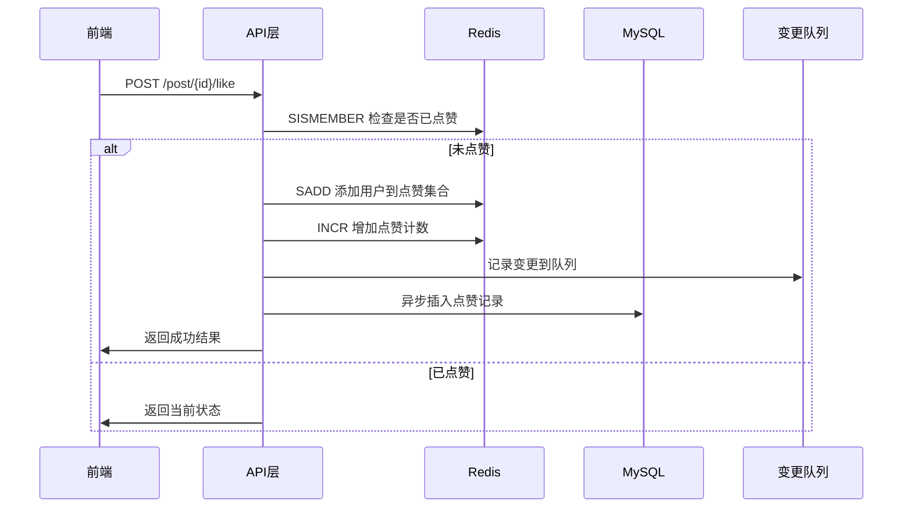
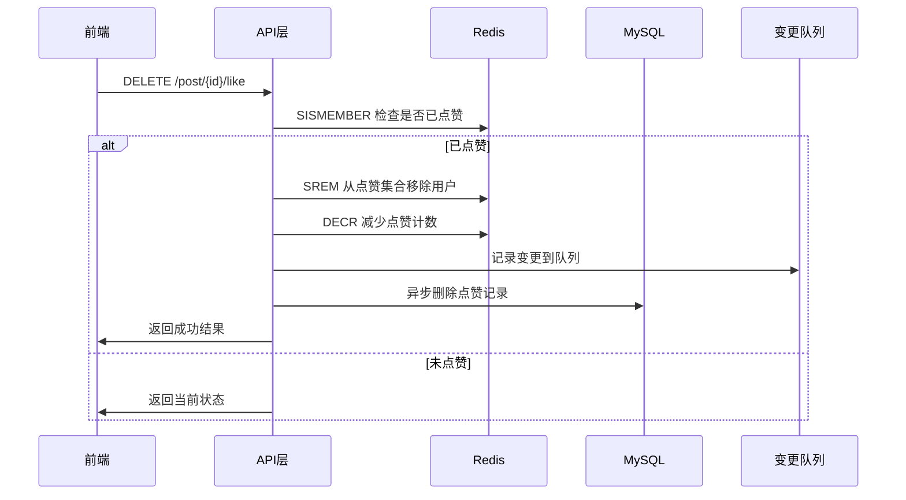
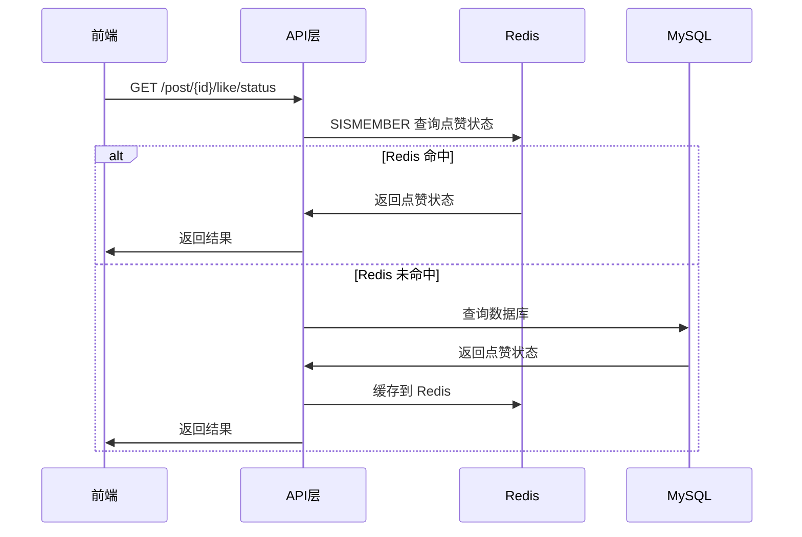

# Redis-based 点赞系统架构设计

## 1. 架构概述

本系统基于 Redis 实现高性能点赞功能，解决了传统 MySQL 方案在高并发场景下的性能瓶颈。系统采用 **Redis 作为缓存与计数加速层，MySQL 作为唯一持久化数据源** 的架构设计。

### 1.1 核心特性
- **高性能**: Redis 内存操作，支持高并发读写
- **防重复**: 使用 Redis Set 数据结构天然防重复点赞
- **数据一致性**: 多层一致性保障机制
- **故障恢复**: 完整的数据恢复和同步机制
- **降级处理**: Redis 故障时自动降级到 MySQL

## 2. Redis Key 设计

### 2.1 Key 命名规范

| Key 类型 | Key 格式 | 数据类型 | 说明 | 示例 |
|---------|----------|----------|------|------|
| 点赞计数 | `post:like:count:{postId}` | String | 存储帖子总点赞数 | `post:like:count:123` |
| 用户点赞状态 | `post:like:user:{postId}` | Set | 存储点赞用户ID集合 | `post:like:user:123` |
| 变更队列 | `post:like:changes` | List | 存储待同步的变更记录 | `post:like:changes` |

### 2.2 Key 设计优势

1. **点赞计数 (String)**
   - 支持原子性的 INCR/DECR 操作
   - 直接存储数值，查询效率高
   - 支持批量获取多个帖子的点赞数

2. **用户点赞状态 (Set)**
   - 天然防重复，避免重复点赞
   - SADD/SREM 操作原子性
   - SISMEMBER 查询用户点赞状态效率高
   - 支持获取所有点赞用户列表

3. **变更队列 (List)**
   - 记录所有点赞/取消点赞操作
   - 支持异步批量同步到 MySQL
   - 提供操作审计和故障恢复能力

## 3. 点赞/取消点赞完整流程

### 3.1 点赞流程



### 3.2 取消点赞流程



### 3.3 查询流程



## 4. 一致性与异常处理策略

### 4.1 写入顺序策略

**策略**: Redis First, MySQL Async
- 优先更新 Redis 缓存
- 异步同步到 MySQL
- 保证用户体验的同时确保数据最终一致性

### 4.2 并发安全处理

1. **Redis 层面**
   - 使用 Redis 原子操作 (SADD, SREM, INCR, DECR)
   - 避免竞态条件

2. **应用层面**
   - 重复点赞检查
   - 异常情况下的状态回滚

### 4.3 故障处理机制

#### 4.3.1 Redis 故障降级

```java
// 伪代码示例
public PostLikeVO likePost(Long postId, Long userId) {
    try {
        // 尝试 Redis 操作
        return redisLikeOperation(postId, userId);
    } catch (RedisException e) {
        log.warn("Redis操作失败，降级到MySQL", e);
        // 降级到 MySQL
        return mysqlLikeOperation(postId, userId);
    }
}
```

#### 4.3.2 MySQL 同步失败处理

```java
// 异步同步失败时的处理
private void asyncSyncToMySQL(Long postId, Long userId, boolean isLike) {
    try {
        // 执行 MySQL 操作
        performMySQLOperation(postId, userId, isLike);
    } catch (Exception e) {
        // 记录到失败队列，后续重试
        recordFailedSync(postId, userId, isLike, e);
        // 或者回滚 Redis 操作
        rollbackRedisOperation(postId, userId, isLike);
    }
}
```

### 4.4 数据一致性保障

#### 4.4.1 最终一致性

- **正常情况**: Redis 和 MySQL 保持一致
- **异常情况**: 通过定时同步任务保证最终一致性
- **数据修复**: 提供手动同步工具

#### 4.4.2 一致性检查

```java
// 定期一致性检查
@Scheduled(fixedRate = 3600000) // 每小时执行
public void consistencyCheck() {
    // 比较 Redis 和 MySQL 数据
    // 发现不一致时进行修复
}
```

## 5. 缓存策略

### 5.1 缓存过期策略

- **过期时间**: 7天
- **续期策略**: 访问时自动续期
- **清理策略**: LRU 自动清理冷数据

### 5.2 缓存预热

```java
// 系统启动时预热热门帖子数据
@PostConstruct
public void warmupCache() {
    // 加载最近7天的热门帖子到 Redis
    List<Long> hotPostIds = getHotPostIds(7);
    for (Long postId : hotPostIds) {
        syncSinglePostFromMySQL(postId);
    }
}
```

### 5.3 缓存重建

```java
// 从 MySQL 重建 Redis 缓存
public void rebuildCache(Long postId) {
    // 1. 清除旧缓存
    clearPostCache(postId);
    
    // 2. 从 MySQL 加载数据
    List<PostLike> likes = loadFromMySQL(postId);
    
    // 3. 重建 Redis 缓存
    rebuildRedisCache(postId, likes);
}
```

## 6. 性能优化

### 6.1 批量操作优化

```java
// 批量获取多个帖子的点赞数
public Map<Long, Long> getPostLikeCounts(List<Long> postIds) {
    // 使用 Redis Pipeline 批量获取
    List<Object> results = redisTemplate.executePipelined(connection -> {
        for (Long postId : postIds) {
            connection.get(LIKE_COUNT_PREFIX + postId);
        }
        return null;
    });
    
    // 处理结果
    return processResults(postIds, results);
}
```

### 6.2 连接池优化

```yaml
# Redis 连接池配置
spring:
  redis:
    lettuce:
      pool:
        max-active: 20
        max-idle: 10
        min-idle: 5
        max-wait: 2000ms
```

## 7. 监控与运维

### 7.1 关键指标监控

- **Redis 命中率**: 缓存命中率统计
- **操作延迟**: 点赞/取消点赞操作耗时
- **同步延迟**: Redis 到 MySQL 同步延迟
- **错误率**: 操作失败率统计

### 7.2 日志记录

```java
// 关键操作日志
log.info("Redis缓存命中 - 点赞状态查询: postId={}, userId={}, result={}", 
         postId, userId, isLiked);
log.info("Redis缓存更新 - 点赞操作: postId={}, userId={}, action={}, newCount={}", 
         postId, userId, action, newCount);
```

### 7.3 运维工具

提供管理接口用于:
- 缓存预热
- 数据同步
- 一致性检查
- 缓存清理
- 统计信息查询

## 8. 扩展性考虑

### 8.1 水平扩展

- **Redis 集群**: 支持 Redis Cluster 模式
- **分片策略**: 按帖子ID进行分片
- **负载均衡**: 多个 Redis 实例负载均衡

### 8.2 功能扩展

- **点赞类型**: 支持不同类型的点赞（如：赞、踩）
- **点赞统计**: 支持更复杂的统计维度
- **实时推送**: 集成 WebSocket 实现实时点赞通知

## 9. 总结

本 Redis-based 点赞系统通过合理的架构设计和完善的一致性保障机制，在保证数据可靠性的前提下，显著提升了系统的并发处理能力和用户体验。系统具备良好的扩展性和运维友好性，能够满足大规模社区应用的需求。

### 9.1 核心优势

1. **高性能**: Redis 内存操作，支持万级并发
2. **高可靠**: 多重一致性保障，数据不丢失
3. **高可用**: 故障自动降级，服务不中断
4. **易运维**: 完善的监控和管理工具

### 9.2 适用场景

- 社交媒体平台
- 内容社区
- 电商评价系统
- 任何需要高并发点赞功能的应用